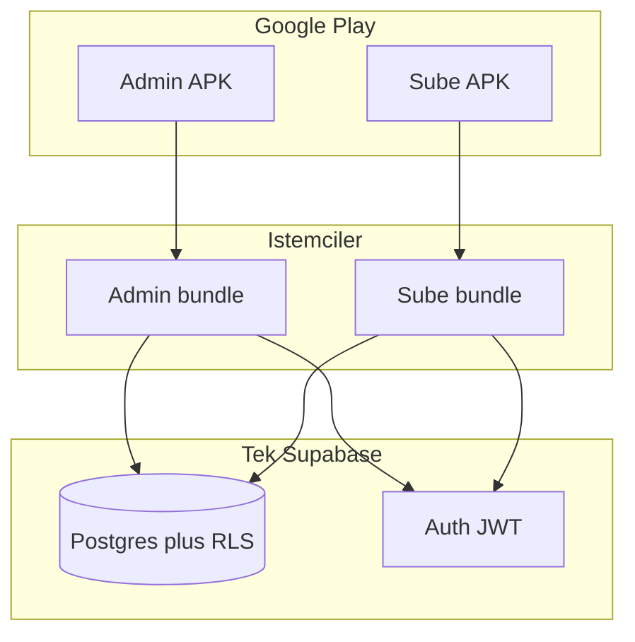

# İki APK + tek Supabase — mimari

Plan maddesi **dual-apk-arch** için netleştirilmiş mimari. **Alternatif C** ile uyumludur.

## Genel görünüm

## Kod ve paketleme

- **Monorepo:** `apps/admin` ve `apps/sube` (veya iki Vite giriş noktası) + `packages/shared` (Supabase client, tipler).
- **Android:** İki **farklı `applicationId`** (örn. `com.sirket.stoksayim.admin` / `com.sirket.stoksayim.sube`), iki ikon ve iki Play Console uygulaması.
- **Ortak:** Aynı `VITE_SUPABASE_URL` ve `VITE_SUPABASE_ANON_KEY` (veya build-time env); fark UI ve route kısıtları.

## Güvenlik prensibi

- APK içindeki anahtar **anon** kalır; yetki **sunucuda** RLS ve ileride **Supabase Auth** + `branch_id` eşlemesi ile sınırlandırılmalıdır.
- Şube kullanıcısı yalnız kendi `branch_id` satırlarına erişmeli; admin geniş yetki — **RLS politikaları** ile tanımlanır (mevcut “tam açık” politikalar üretim öncesi sıkılaştırılmalıdır).

## Veri al / veri gönder

| Katman | Admin | Şube |
|--------|-------|------|
| **Canlı** | Tüm şubeler, onay, rapor, şube stok, dönem | Kendi şubesi, sayım, geçmiş |
| **Toplu gönder** | Excel/ürün içe aktarma, dönem export | İsteğe bağlı sayım özeti CSV/JSON |
| **Toplu al** | Şube paketi / CSV içe aktarma | Ürün listesi çekme (online) |

Play açıklamasında verinin **Supabase bölgesi** ve **KVKK** kapsamında işlendiği kullanıcıya açık yazılmalıdır.

## Sonraki teknik adımlar (kod)

1. RLS: `branch_id` ile şube izolasyonu; admin için `service_role` veya ayrı rol.
2. İki APK build pipeline (CI) ve imzalama anahtarları.
3. İsteğe bağlı: dosya seçici / paylaşım için Capacitor eklentileri.
